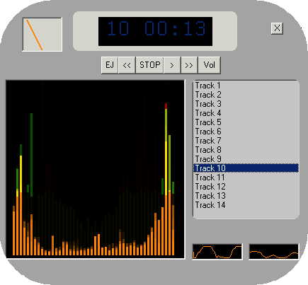



## \[ Matt Player \]

### Description

This program was put together to visualize sound by audio spectrum, Oscilator, VU meters. It is a simple CD player also.

NOTE: Please compile the source to use. The IDE is slower.

This is my first entry on the "Planet". If I get good ratings I will post more cool stuff. So please vote.
 
### More Info
 
NOTE: The visualization will not work unless either the Wave OUT Mixer, or CDPlayer

is selected in the volume control under the Recording Control. If anyone knows how to

programmatically set these settings let me know.

             |
---                |---
**Submitted On**   |2004-07-02 15:24:36
**By**             |[Matt G](https://github.com/Planet-Source-Code/PSCIndex/blob/master/ByAuthor/matt-g.md)
**Level**          |Advanced
**User Rating**    |4.5 (117 globes from 26 users)
**Compatibility**  |VB 5\.0, VB 6\.0
**Category**       |[Sound/MP3](https://github.com/Planet-Source-Code/PSCIndex/blob/master/ByCategory/sound-mp3__1-45.md)
**World**          |[Visual Basic](https://github.com/Planet-Source-Code/PSCIndex/blob/master/ByWorld/visual-basic.md)
**Archive File**   |[Matt\_Playe176515722004\.zip](https://github.com/Planet-Source-Code/matt-g-matt-player__1-54720/archive/master.zip)

